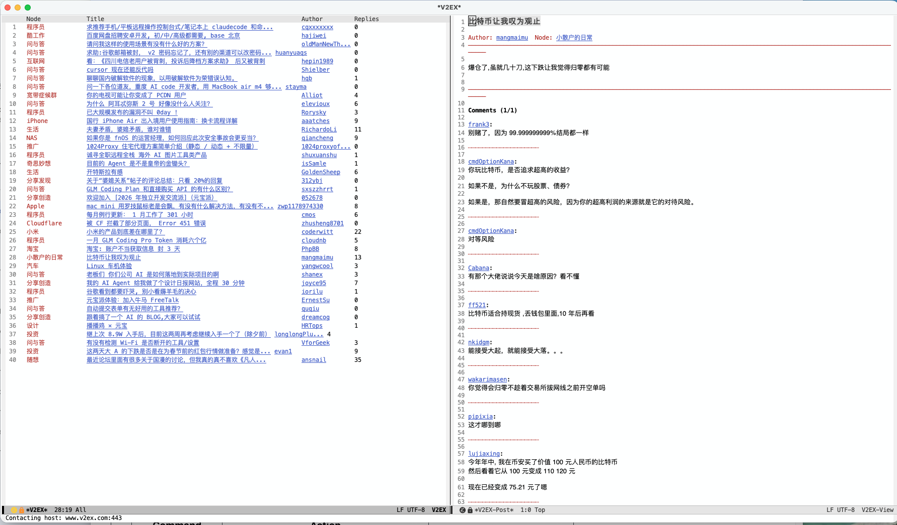

# v2ex.el

> A lightweight, feature-rich [V2EX](https://v2ex.com/) client for Emacs. Browse topics, read comments, and navigate nodes without leaving your editor.

## Features

- Co-authored by Google Gemini (Google AI).
- Integrated Browsing: View the latest topics or dive into specific nodes (e.g., qna (问与答), python).
- Markdown Rendering: Uses Emacs's built-in shr engine to render posts and comments with high fidelity (bold, lists, links).
- Pagination: Full support for paginated results in node views with a "Load More" button and "Jump to Page" command.



## Installation

1. Clone this repository or save `v2ex.el` to your load path.

2. Add the following to your `init.el`:

   ```emacs-lisp
   (require 'v2ex)

   ;; Configure your API token
   ;; Navigate to https://v2ex.com/settings/tokens to get your access token.
   ;; Create this file and paste your V2EX Personal Access Token (v2) inside.
   (setq v2ex-token-file "~/.config/v2ex/token.txt")
   ```

## Usage

### Commands

| Command | Action |
|:---:|:---:|
| `M-x v2ex` | Open the latest topics list. |
| `M-x v2ex-node` | Prompt for a node name (slug) to browse. |

### Key-bindings

- In toppic list:

  - `RET`: Open topic or jump to node.
  - `m`: Load more topics (in node view).
  - `j`: Jump to a specific page.
  - `g`: Refresh list.


- In topic view:

  - `n`/`p`: Next/Previous page of comments.
  - `l`: Return to the topic list buffer.
  - `g`: Refresh current topic.
  - `q`: Quit window.

